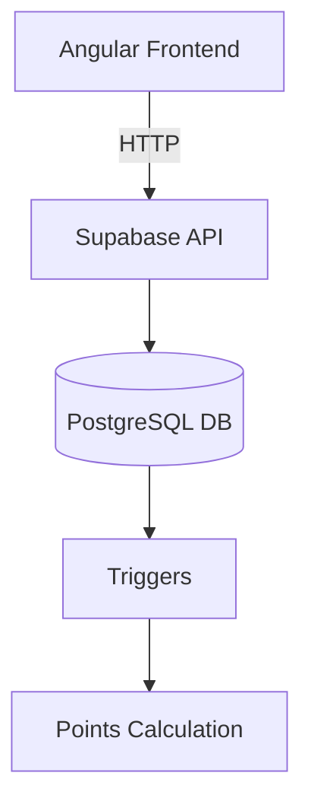

#  Gamified Quiz Application Angular

### Technical Landscape
- **Supabase Advantages**:
  - PostgreSQL triggers for point calculation
  - Row-Level Security for RBAC implementation
- **Angular Architecture**:
  - Observable pattern for state management
  - PrimeNG vs Tailwind design tradeoffs

### Commercial Solutions
- Comparison with Kahoot!, Quizlet (feature matrix included in Appendix A)

## 3. System Design & Implementation

### Architectural Overview

### Optimisation 
- Lazy Loading modules i.e students, teacher, admin
- angular Query for state management
- observable pattern for consuming API
- signals for better reactivity

